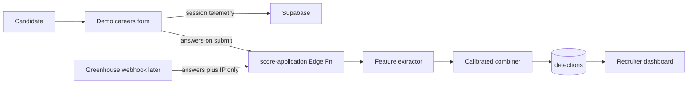

# Anti-slop ATS: auto-apply detection demo

Standalone demo (`anti-slop-ats`) with a telemetry-instrumented careers form, a recruiter review UI, and a Supabase backend that scores applications as auto-apply (`1`) vs human (`0`) with a calibrated probability and feature-based reasoning. Live Greenhouse is not required for the demo.

## Decisions already locked

- **New standalone demo**, project name **`anti-slop-ats`**. Create a shared git repo for the team, then scaffold the app inside it.
- **Label policy:** `1` = auto-apply / bot-filled. A human who uses AI to *draft* answers but fills the form themselves is **`0`**. Text-only “AI-isms” (em dashes, buzzwords) never flip the label by themselves.
- **Backend:** Supabase on the **team organization** (not a personal project). Choose a region with the team. Before creating the cloud project, run `get_cost` / `confirm_cost` and confirm the listed cost.
- **ATS for the demo:** none required. Target later integration is **Greenhouse** (most common for tech hiring; Harvest + `Candidate has submitted application` webhook). Workday is Fortune-500 dominant but a worse first integration.

## Why the careers site must be ours (not just an ATS)

Greenhouse (and most ATS) only see **submitted answers + metadata**. They do **not** see typing cadence, section jumps, paste events, or browser fingerprints unless the **careers page** is instrumented.



Two ingest modes:

| Mode | Signals available | Used in demo |
| --- | --- | --- |
| `live_form` | Speed, cadence, paste, fingerprint, IP, answers | Yes — primary |
| `ats_text_only` | Answers, IP if present, placeholders, AI-isms | Yes — Greenhouse-shaped webhook fixture |

ATS-only mode will usually produce **lower confidence** because behavioral features are missing. That is the product truth, not a bug.

## Architecture

**Frontend (Vite + React):**

- **Apply flow:** multi-section job form (contact, experience, 3–5 open questions, EEO optional). Collects:
  - per-field `focus` / `blur` / `input` / `paste` timestamps
  - section-order / jump count
  - total time to submit
  - FingerprintJS `visitorId` (client)
- **Recruiter dashboard:** live list of applications with `P(auto_apply)`, `0/1` at a default threshold (0.7), and natural-language reasoning. Toggle “human vs bot replay” fixtures for the demo.

**Supabase:**

- Postgres + RLS + Realtime on `detections`
- Edge Functions: `ingest-telemetry`, `score-application`, `greenhouse-webhook` (signature-verified; JWT verify off, custom GH secret)
- Optional anon apply session vs authenticated recruiter (`auth.users` + `recruiters` table)

**Scoring (not a giant LLM in the loop):**

1. **Deterministic features** (high precision, explainable).
2. **Calibrated combiner** → `probability` in `[0,1]` and `label = probability >= threshold`.
3. **Reasoning** from top contributing features (always). Optional LLM polish later; not required for v1.

**Jev / Laya:** both are System One models: unstructured state in, **typed probabilities out, no generated text**. They fit the classifier, not the writeup.

- **Jev** (TypeSafe): best API fit (`noul` / choice + calibrated P). Early access / waitlist. Edge Function adapter behind `TYPESAFE_API_KEY`. If the key is absent, skip.
- **Laya** (`convaiinnovations/laya`): Apache-2.0, ~33ms locally, **421M — will not run on Supabase Edge**. Zero-shot typed-decisions is weak without fine-tuning. Defer a Python worker; do not block the demo on it.

v1 ships a **logistic / Platt-scaled linear model on engineered features** with the same I/O as Jev (`state` + questions → `{ label, p, confidence }`) so Jev can drop in later.

## Feature set (inputs)

**Behavioral (form only)**

- Overall duration vs field count (sub-human fill times)
- Inter-field cadence: near-zero variance, simultaneous fills, no dwell on long-text
- Section jumps (non-linear tab order — typical of auto-fillers)
- Paste ratio on essay questions
- Fingerprint reuse across many applications in a short window
- Headless / automation UA hints (secondary; easy to spoof)

**Network**

- Client IP + datacenter/VPN ASN flag
- Rate: same IP or fingerprint submitting many jobs

**Text (answers)**

- Leftover placeholders: `[Company]`, `lorem ipsum`, `TBD`, `N/A` on required essays, tool watermarks if any
- Em dashes / stock AI-isms — **weak evidence only**, used in reasoning, not as a hard rule
- Buzzword stuffing vs the job description (token overlap / jargon density)

Hard rules that can force **high-confidence 1** (still overridable in the UI): leftover placeholders **and** superhuman speed, or fingerprint burst-apply. AI-isms alone never force 1.

## Outputs

Stored on each `detections` row and returned by the API:

```json
{
  "label": 1,
  "probability": 0.91,
  "threshold": 0.7,
  "confidence": 0.86,
  "mode": "live_form",
  "reasoning": "42 fields in 3.1s; 6 section jumps; leftover '[Company Name]' in Q2; same fingerprint submitted 9 times in 12 minutes.",
  "features": { "duration_ms": 3100, "placeholder_hits": 1, "section_jumps": 6 }
}
```

`confidence` is not the same as `probability`: it drops when telemetry is missing (`ats_text_only`) or features disagree.

## Data model (Supabase)

- `jobs` — demo job + JD text (for buzzword overlap)
- `application_sessions` — form session, fingerprint, IP, started_at
- `telemetry_events` — append-only field events (no full keystroke logs)
- `applications` — submitted answers (jsonb), source, duration_ms
- `detections` — label, probability, confidence, reasoning, feature jsonb, model_version
- `known_fingerprints` — optional burst counters

RLS: public insert on sessions/events/applications for the demo form (scoped, no PII in events); recruiter-only read on detections. Hash emails; do not store raw resumes in v1.

## Greenhouse later (not blocking)

`greenhouse-webhook` accepts the Harvest “application submitted” payload, maps `answers` + `custom_fields`, scores in `ats_text_only` mode. Optional Harvest PATCH to a custom field `auto_apply_probability` when `GREENHOUSE_HARVEST_KEY` exists. Demo uses a checked-in fixture JSON, not a live GH org.

## Implementation order

1. Create the `anti-slop-ats` git repo and scaffold the app.
2. Vite React app + recruiter/apply routes; local scoring first so the UI works without cloud.
3. Confirm Supabase cost with the team, create project `anti-slop-ats` on the shared org, apply migrations, deploy Edge Functions, wire env keys via secrets (never commit them).
4. Seed two jobs + fixture packs: **human slow fill**, **bot burst**, **human+AI essays** (must score 0), **placeholder bot**.
5. Dashboard with live scores and reasoning; optional Jev adapter if a key is provided.

## Out of scope for v1

Live Greenhouse/Workday tenant, Laya GPU worker, training a production ML model on real candidate data, browser-extension detection of named vendors (Tsenta, Simplify, LazyApply, etc.) beyond generic automation signals.
