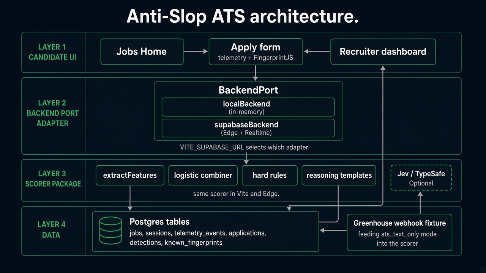

# Anti-Slop ATS

Standalone demo that scores job applications as **auto-apply / bot (`1`)** vs **human (`0`)** with calibrated probability, confidence, and feature-based reasoning. A Vite careers form captures behavioral telemetry; a recruiter UI reviews detections. See [PLAN.md](./PLAN.md) for product scope and [SPEC.md](./SPEC.md) for contracts.

**Build and phases:** [BUILD.md](./BUILD.md)

## Architecture



Four layers, one UI:

| Layer | What it is |
| --- | --- |
| **UI** | Vite + React SPA (`apps/web`) — jobs home, instrumented apply form, recruiter dashboard |
| **BackendPort** | TypeScript adapter (`localBackend` or `supabaseBackend`) — the only backend surface the UI uses |
| **Scorer** | Shared package (`packages/scorer`) — features, Platt-scaled logistic, hard rules, template reasoning |
| **Postgres** | Supabase schema + Edge Functions + Realtime on `detections` (when cloud is enabled) |

**Backend switch (env):** if both `VITE_SUPABASE_URL` and `VITE_SUPABASE_ANON_KEY` are set, the app uses `supabaseBackend` (Edge + Postgres + Realtime). Otherwise it uses `localBackend` (in-memory maps; scoring still runs in-process). Details and diagrams: [docs/architecture.md](./docs/architecture.md).

**Repo map:** `apps/web` · `packages/scorer` · `supabase/` · `fixtures/` — full table and runtime flows in the architecture doc.

## Quick start (local)

Default is local backend — leave Supabase env vars unset. See BUILD.md environment gotchas and SPEC.md §6 for Node pin and ports.

```bash
npm install
npm run dev
```
