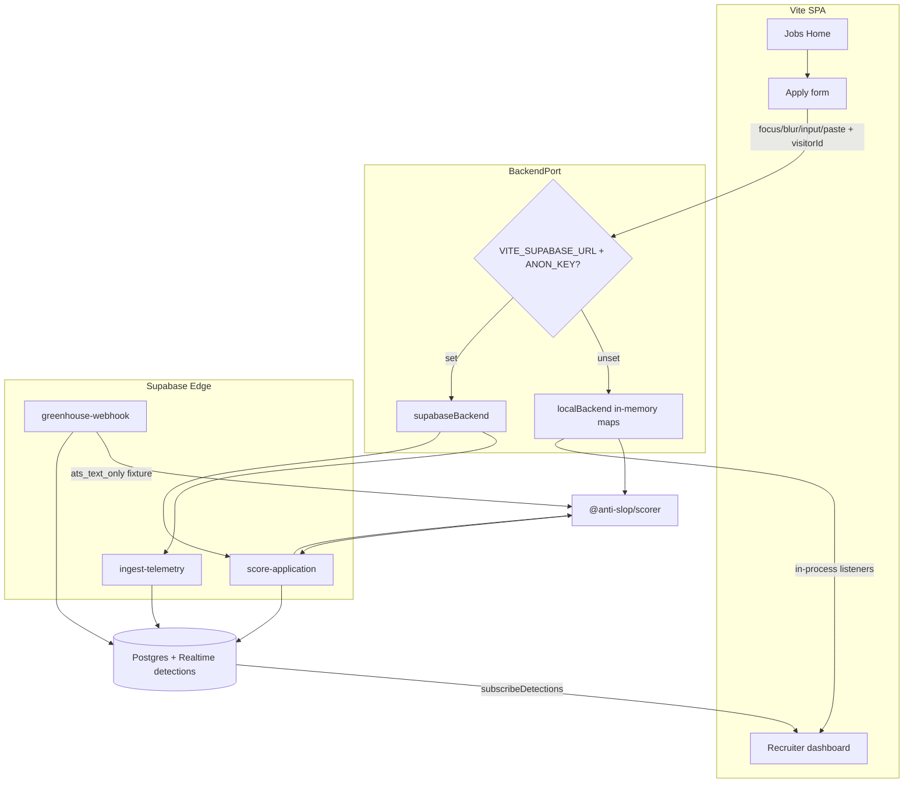
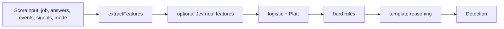

# Anti-Slop ATS architecture

Standalone demo that scores a job application as **auto-apply / bot (`1`)** vs **human (`0`)**. It is not a live ATS. The careers form is first-party so we can see typing, paste, section jumps, and a browser fingerprint — signals Greenhouse never gets.

Visual:

## What the system is

A Vite + React SPA with three routes (`/`, `/apply/:slug`, `/recruiter`), a shared TypeScript scorer (`packages/scorer`), and a **BackendPort** that is either in-memory or Supabase (Edge Functions + Postgres + Realtime). Env selects the adapter:

- `VITE_SUPABASE_URL` **and** `VITE_SUPABASE_ANON_KEY` set → `supabaseBackend`
- otherwise → `localBackend` (UI still scores)

Label policy: AI-drafted essays filled by a human stay `0`. Text-only AI-isms never flip the label. Hard rules can force high-confidence `1` (placeholder + superhuman speed, or fingerprint burst).

## Repo shape

| Piece | Role |
| --- | --- |
| `apps/web` | Careers UI, telemetry collector, FingerprintJS, BackendPort adapters |
| `packages/scorer` | Features → Platt-scaled logistic → hard rules → template reasoning |
| `supabase/` | Schema, RLS, Realtime on `detections`, three Edge Functions |
| `fixtures/` | Two jobs, lexicons, four labeled replay packs, Greenhouse Harvest JSON |

## Runtime flow

**Apply path (`live_form`):** create session → flush telemetry while filling → submit answers → scorer returns a `Detection` (label, probability, confidence, reasoning, features).

**ATS path (`ats_text_only`):** Greenhouse-shaped webhook (demo: checked-in Harvest fixture). Answers + optional IP only. Confidence is systematically lower because behavior is missing.

**Demo packs:** recruiter replay toggle drives `human_slow_fill` (`0`), `bot_burst` (`1`), `human_ai_essays` (`0`), `placeholder_bot` (`1`) through the same port.

## BackendPort

The UI never talks to Postgres or Edge directly except through this interface (`apps/web/src/lib/types.ts`):

`listJobs` / `getJob` · `createSession` · `ingestTelemetry` · `submitApplication` · `listDetections` · `overrideLabel` · `replayPack` · `subscribeDetections`

`selectBackend()` in `apps/web/src/lib/backend.ts` picks the implementation once via `getBackend()`.

Local backend keeps sessions, events, applications, detections, and burst counters in Maps and calls `scoreApplication` in-process. Cloud backend hashes email/IP client-side where needed, invokes Edge, and subscribes to Realtime on `detections`.

## Scorer pipeline

Same code in Vite (workspace package) and on Edge (`supabase/functions/_shared/scorer.ts` re-exports it; not a published npm package).

1. **Deterministic features** — duration vs field count, cadence variance, section jumps, paste ratio, fingerprint/IP burst, datacenter CIDR, placeholders, buzzword overlap vs JD, weak AI-ism rates.
2. **Combiner** — weighted logit → probability; `label = probability >= 0.7`.
3. **Hard rules** — `placeholder_and_speed` or `fingerprint_burst` raise probability to a high floor. AI-isms never do this.
4. **Confidence** — not the same as probability. Drops for `ats_text_only`, missing telemetry, or disagreeing features.
5. **Reasoning** — assembled from top features, not an LLM. Jev (TypeSafe) is optional behind `TYPESAFE_API_KEY`; skipped if unset. Laya is out of v1 (too large for Edge).

## Data (when cloud is on)

Postgres tables: `jobs`, `application_sessions`, `telemetry_events` (append-only field events, not keystroke logs), `applications` (answers jsonb), `detections`, `known_fingerprints`, `known_ips`, `recruiters`.

RLS sketch: public read on jobs; anon insert on sessions/events/applications; recruiter-authenticated read/update on detections. Emails and IPs are hashed; no raw resumes in v1. Realtime publication is on `detections` so the dashboard updates live.

Edge Functions:

| Function | Job |
| --- | --- |
| `ingest-telemetry` | Append events to a session |
| `score-application` | Persist application, run scorer, write detection, bump burst tables |
| `greenhouse-webhook` | Map Harvest payload, score `ats_text_only` (JWT verify off; GH secret) |

## Why it is split this way

The careers page must be ours or there is no behavioral signal. The scorer is a small calibrated model so every score is explainable on the recruiter screen. BackendPort lets the demo run with zero cloud, then the same UI lights up against Supabase without a second apply flow.
